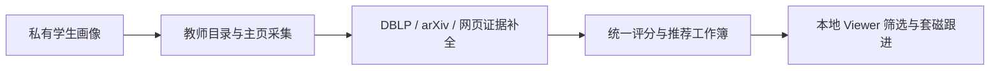

# Tutor Recommendation

<p align="center">
  
</p>

## 项目简介

Tutor Recommendation 是一个本地运行的导师推荐与套磁管理工作区。它把学生画像、学院教师目录和公开学术证据整理为可复核的推荐工作簿，并通过网页看板管理套磁日期、回复进展和备注。

项目强调“证据辅助、人工决策”：推荐等级来自统一规则，教师主页和官方材料提供核心方向锚点，DBLP、arXiv、已知网页及可选 WebSearch 用于补充证据，不会仅凭论文关键词自动判定导师适合。

- 私有画像、生成结果和联系状态默认只保存在本机。
- 推荐理由、证据来源、身份置信度和评分警告均可审计。
- 支持多学院教师去重以及有证据的跨学院归属。
- Viewer 同时提供套磁日历、推荐列表和教师详情。

## 项目介绍



| 模块 | 作用 |
| --- | --- |
| 学生画像 | 配置关注方向、关键词和权重，正式运行缺失时直接报错 |
| 三阶段研究流程 | 采集官方信息，补充 DBLP，再完成 arXiv 与网页证据 |
| 排名与审计 | 输出 `强烈建议`、`可以考虑`、`暂不优先` 及可读理由 |
| 本地 Viewer | 查看日历和推荐列表，编辑套磁状态、日期、回复与备注 |

生成文件位于 `outputs/<school_slug>/<college_slug>/`，通常包括综合推荐工作簿、阶段 checkpoint、证据 cache 和运行清单。人工联系状态统一保存在 `outputs/contact_status.json`；Excel 是查看和交付产物，JSON 是本地可编辑状态源。

Viewer 用连续四周条带展示套磁情况：星期作为固定列头，每行按本周、上周或下周等相对名称标记，每次前后移动一周。每天只显示不同回复状态的颜色和数量，点击日期后再查看当天教师；已安排具体面试时间的记录使用菱形标记。日历拥有独立的学校和学院筛选，并可单独收起；教师列表按推荐等级和匹配分排序，详情中可维护精确到分钟的面试时间。页面固定为一个视口，日历、表格和详情在各自区域内滚动。

隐私文件不会进入版本控制，包括 `data/private/`、`docs/private/`、`outputs/`、简历、工作簿、cache 和联系状态。不要手工把真实申请材料或教师级联系决策提交到公开仓库。

## 快速开始

### 1. 下载并安装

```powershell
git clone https://github.com/SsQqHuNtMaN/tutor-recommendation.git
cd tutor-recommendation
python -m pip install -r requirements.txt
```

### 2. 准备学生画像

PowerShell：

```powershell
Copy-Item data/templates/student_profile.example.json data/private/student_profile.json
```

Bash：

```bash
cp data/templates/student_profile.example.json data/private/student_profile.json
```

编辑 `data/private/student_profile.json`，填写自己的研究方向、关键词和权重。简历及申请材料也应放在 `data/private/`。正式运行不会自动使用公开示例画像；临时演示需要显式传入 `--demo-profile`。

### 3. 选择目标并生成结果

先查看已支持的目标键：

```powershell
python build_teacher_match.py --help
```

然后依次运行三个阶段：

```powershell
python build_teacher_match.py <target>
python update_teacher_match_with_dblp.py <target>
python complete_teacher_research.py <target>
```

同一学校存在重叠学院时，应在一次首阶段命令中同时传入这些目标键，以便执行跨学院身份去重。需要新增目标学院或调整页面解析时，可让 Coding Agent 先阅读 `AGENTS.md` 和 `docs/runbook.md` 后完成适配。

### 4. 打开本地看板

Windows：

```powershell
.\start_viewer.bat
```

Linux 或 macOS：

```bash
./start_viewer.sh
```

浏览器访问 `http://127.0.0.1:8765/`。如果页面提示 `/api/session` 为404，说明旧 Viewer 仍占用端口；关闭旧进程后重新启动，不要删除 `outputs/contact_status.json`。

如需把看板中的联系状态同步回工作簿：

```powershell
python sync_contact_status_to_workbooks.py
```

### 5. 检查结果

```powershell
python checkpoint_doctor.py <target>
python result_quality_audit.py --fail-on-violations
```

完整命令、故障排查和方法说明见 [运行手册](docs/runbook.md)、[工作流方法论](docs/teacher-matching-workflow.md) 和 [输出目录规则](docs/output-organization.md)。
