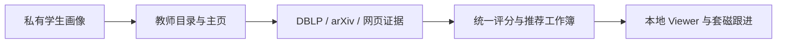

# Tutor Recommendation

<p align="center">
  
</p>

Tutor Recommendation 是一个本地运行、证据可复核的导师推荐与套磁管理项目。它把私有学生画像、学院教师目录和公开学术证据整理为推荐工作簿，并通过 Viewer 管理联系日期、回复进展、面试时间和备注。

> 设计原则：证据辅助、人工决策；真实画像、生成结果和联系状态默认只留在本机。

## 当前项目

### 能做什么

- 从学院目录和教师主页采集教师名单、方向、简介、邮箱与主页。
- 使用统一 ranking policy 生成 `强烈建议`、`可以考虑`、`暂不优先`，并保留理由、锚点和评分警告。
- 补充 DBLP、arXiv、已知网页、官方 PDF 和可选 bounded WebSearch 证据。
- 处理跨学院重复教师，并只在官方证据支持时保留多学院归属。
- 在本地 Viewer 中查看四周套磁日历、校院进度概览、推荐列表和教师详情。
- 编辑 `套磁情况`、`套磁时间`、`回复情况`、`约面试时间` 与备注；人工状态统一保存到 `outputs/contact_status.json`。

### 从输入到结果



正式输入和输出均不进入 Git：

```text
data/private/student_profile.json
outputs/<school_slug>/<college_slug>/
outputs/contact_status.json
docs/private/
```

### 最短使用路径

安装依赖并准备本地画像：

```powershell
python -m pip install -r requirements.txt
Copy-Item data/templates/student_profile.example.json data/private/student_profile.json
```

查看目标键并运行三阶段流程：

```powershell
python build_teacher_match.py --help
python build_teacher_match.py <target>
python update_teacher_match_with_dblp.py <target>
python complete_teacher_research.py <target>
```

启动 Viewer：

```powershell
.\start_viewer.bat
```

浏览器打开 `http://127.0.0.1:8765/`。日历与教师列表拥有独立筛选和重置入口；非敏感筛选偏好保存在浏览器本地，搜索词、教师 ID 和联系内容不会写入 `localStorage`。详情支持前后切换和页内快速定位，校院概览按现有联系状态只读聚合，不新增第二份状态源。

交付前运行：

```powershell
python checkpoint_doctor.py <target>
python result_quality_audit.py --fail-on-violations
```

需要更多命令和方法说明时，阅读：

- [运行手册](docs/runbook.md)
- [教师匹配工作流](docs/teacher-matching-workflow.md)
- [输出目录规则](docs/output-organization.md)
- [Viewer 布局与交互](docs/viewer-integrated-layout.md)
- [WebSearch 补充层](docs/web-search-supplement.md)

## 如何使用 Coding Agent

<p align="center">
  
</p>

这个仓库已经把 Coding Agent 需要的稳定规则放在 [AGENTS.md](AGENTS.md)。推荐在仓库根目录启动 Codex 或其他 Coding Agent，让 Agent 先理解隐私边界、目标注册、证据规则、输出契约和验证命令，再开始抓取或修改代码。

### 1. 准备本地上下文

先创建并编辑：

```text
data/private/student_profile.json
```

如需保留当前运行进度、人工判断或下一步，把它们写到：

```text
docs/private/project-context.local.md
docs/private/handoff.local.md
```

这些路径已被 Git 忽略。不要把简历、申请表、教师级证据、联系状态或当前结果计数写入公开文档。

### 2. 给 Agent 一个可验收任务

可直接使用下面的提示模板：

```text
先阅读 AGENTS.md；如果 docs/private/project-context.local.md 存在，也读取它。

目标：
<描述本次要新增的学院、修复的问题或需要继续的研究阶段>

约束：
- 不修改学生画像权重和 ranking policy，除非我明确授权。
- 不根据研究方向猜教师身份或学院归属。
- 不把 data/private、docs/private、outputs 或联系状态写入 Git。
- 保留现有未提交改动。

验收：
- 运行相关单元测试。
- 运行 git diff --check。
- 若影响研究结果，运行 checkpoint doctor 和质量审计。
- 若影响 Viewer，使用真实浏览器验证桌面与窄屏。
```

### 3. 常见 Agent 任务

新增学院目标：

```text
为 <学校 / 学院> 增加目标。注册 target，解析官方目录和主页，
保持输出列兼容，运行三阶段流程，并检查身份与学院归属风险。
```

继续中断的研究：

```text
检查 <target> 的 run_manifest 和 checkpoint 覆盖，
只重跑缺失或 stale 的阶段；不要用 partial finalize 掩盖缺口。
```

改进 Viewer：

```text
保持 outputs/contact_status.json 为唯一人工状态源，
不要在 JavaScript 中重新评分。完成后验证筛选、日历、详情、
自动保存和 390px 页面溢出。
```

完成阶段收尾：

```text
执行 /neat：对照代码整理 README、AGENTS.md、docs/ 和本地记忆，
把未来探索与 TODO 留在 docs/private，不把进度日志写进公开文档。
```

### 4. Agent 必须遵守的边界

- 正式运行缺少私有画像时应失败，不自动回退到公开示例。
- 推荐必须来自统一 policy；DBLP、arXiv 和 WebSearch 不能绕过官方核心方向锚点。
- 同校同名不自动合并；多学院归属必须有官方材料或人工复核记录。
- 自动 WebSearch 只用于发现来源，不直接改变推荐等级。
- Viewer 只监听 loopback，不能为了方便暴露到局域网。
- Coding Agent 可以整理证据和执行检查，但最终联系决策仍由用户人工确认。
